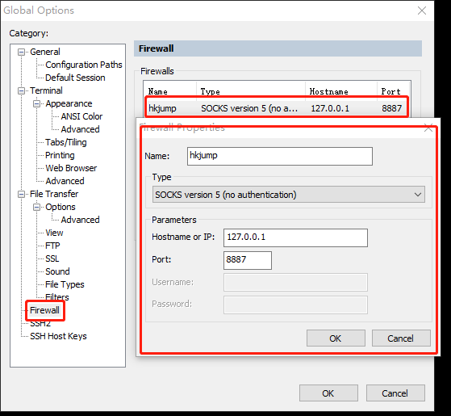
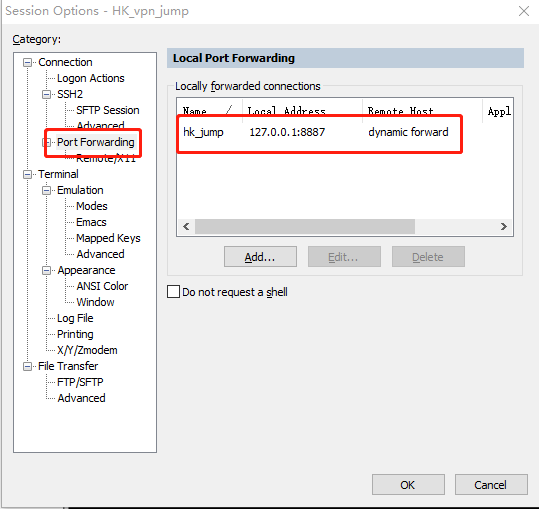
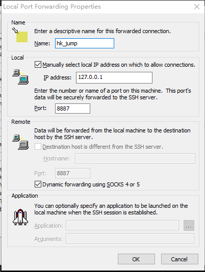
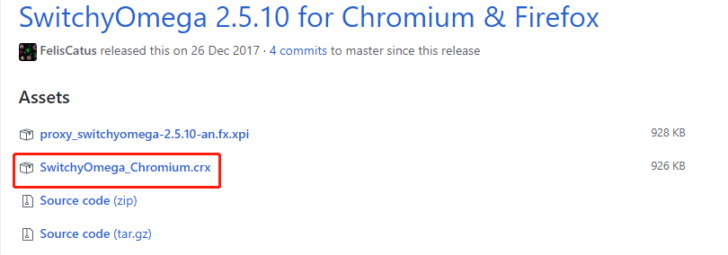
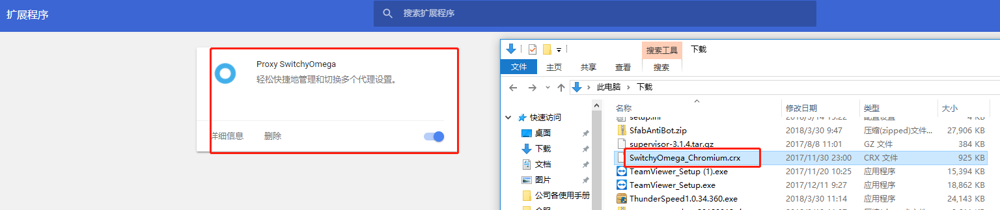
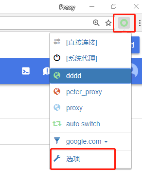
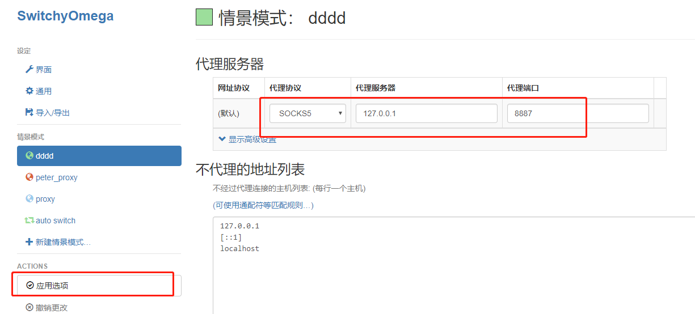
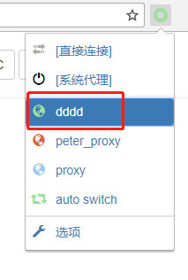
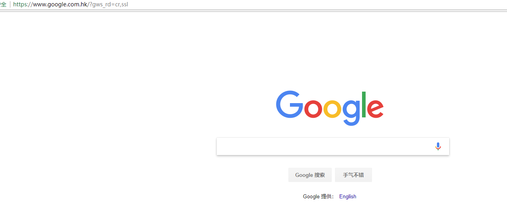

## 一、首先得有一台国外或香港的服务器
环境：一台位于香港的CenOS 服务器 
         使用 SecureCRT 连接到该台服务器
 
 
### 1、新建一个防火墙，点击SecureCRT的 Options --》Global Options，新建一个如下的防火墙（代理），将通过本地127.0.0.1:8887的数据进行socket 5代理转发 
 
 
###  2、打开已经准备的香港服务器的Session Options，新建一个本地端口转发规则 
 
 
 
## 二、使用chrome 浏览器，下载SwitchyOmega代理
### 1、下载SwitchyOmega
下载地址：https://github.com/FelisCatus/SwitchyOmega/releases 

 
### 2、安装SwitchyOmega
打开刚下载文件所放的目录，并且打开chrome浏览器的“扩展程序”，使用拖拉的方式将下载好的SwitchyOmega_Chromium.crx 拖拉到扩展程序界面 

### 3、配置SwitchyOmega代理
在Chrome浏览器，打开SwitchyOmega选项，如下图所示 
 
点击“新建情景模式”，填入一个名称，其他默认，在点击“创建”。 
如下图所示的名为"dddd"的情景模式，在"代理服务器"这里，将代理协议设置为"SOCKS5",代理端口设置为"8887"，设置完毕以后点击"应用选项" 
 
### 4、最后在chrome浏览器上，将SwitchyOmega选择刚刚新建的“dddd”情景模式
 

### 5、最后，我们可以验证刚刚配置代理是否有效了，打开“www.google.com”试试看
 
